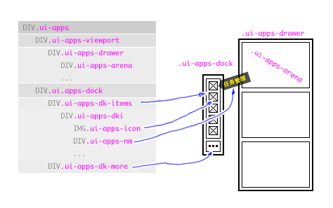

应用程序架:ui.apps
====
> 将一组 UI 组合在一起，提供各个 UI 之间的切换功能。  本 UI 建议直接绑定到 `document.body` 上

#### 使用方式

本 UI 通过下面的方法进行初始化

	$ui("ui.apps").bind(document.body, {
		// 给定一个全局的特殊选择器，以便你定制自己的显示样式
		className : 'myApps',   
		//-----------------------------------------------------------
		// 你可以直接给一个 JS 数组，用 function 返回可以动态加载
		data : function(){
			return [{
				key  : 'zfile:34ca31c913210', // app 的唯一键值
				ui   : 'ui.zfile.browser',    // 应用的 UI 类型
				name : '素材库',      // app 的显示名称，UName 格式
				dock : true          // 是否出现在 dock 中
			},{
				// 下一个 app 的配置信息
			}];
		}
	});
	
#### 鸭子模型

所有的加入 apps 的 UI 的绑定实例，都必须具备如下方法

	// 重绘制 UI
	redraw();

#### DOM 模型

本UI会创建下面的 DOM 模型:

#### 特殊CSS的意义

* `ui-apps-current` : 附加在 `ui-apps-arena` 上，表示当前的 app